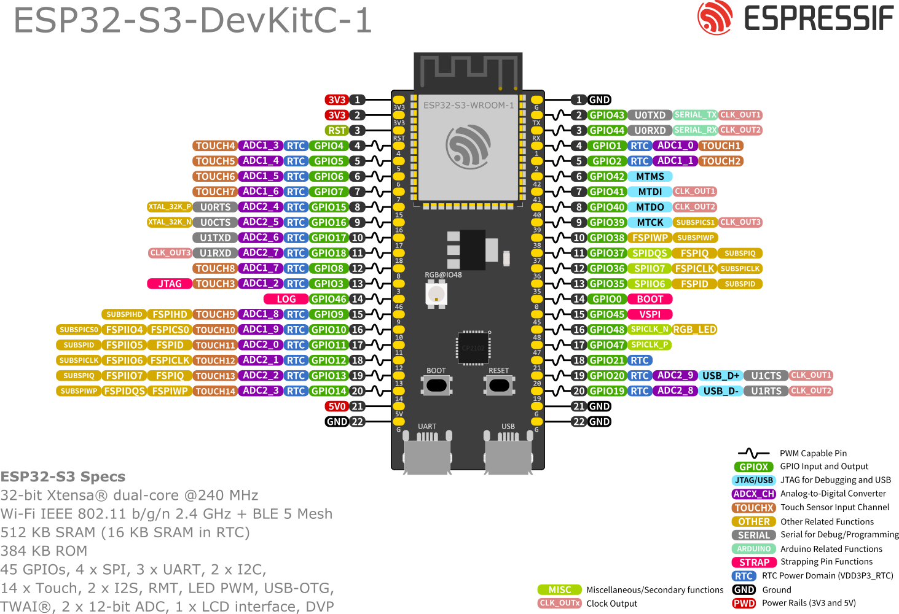
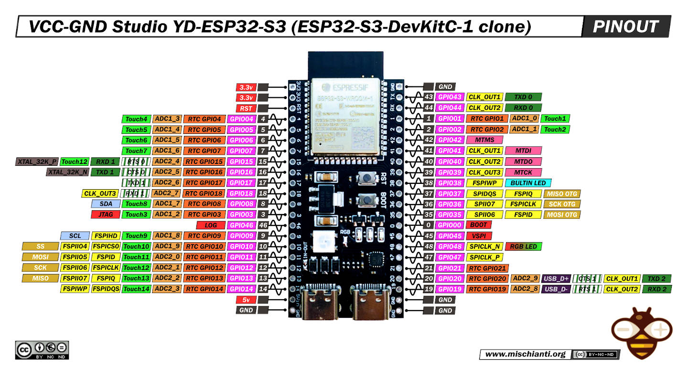

# BThome-US-Ranging
BThome US ranging sensor e.g. for water or oil level measurments

NOTE: For the Packet ID and Firmware Version, the latest sources from the BTHomeV2-Arduino library [Pull Request #1](https://github.com/deeja/BTHomeV2-Arduino/pull/1) are required. The current version in PlatformIO is not sufficient. 

To make use of it, step into the `lib` directory and run:

```bash
cd lib
git clone git@github.com:the78mole/BTHomeV2-Arduino.git
git pull origin adding_fwversion_packetid_device_id
```


## Development Hardware

To develop this project, I used a [clone](https://mischianti.org/vcc-gnd-studio-yd-esp32-s3-devkitc-1-clone-high-resolution-pinout-and-specs/) of the [ESP32-S3-DevKitC-1](https://docs.espressif.com/projects/esp-idf/en/v4.4.3/esp32s3/hw-reference/esp32s3/user-guide-devkitc-1.html).

Excessive Documentation is available on [michianti.org](https://mischianti.org/vcc-gnd-studio-yd-esp32-s3-devkitc-1-clone-high-resolution-pinout-and-specs/).

There is also a [Datasheet of the ESP32-S3-WROOM-1 Module](https://www.espressif.com/sites/default/files/documentation/esp32-s3-wroom-1_wroom-1u_datasheet_en.pdf) available. The [ESP32-S3 Technical Reference Manual](https://www.espressif.com/documentation/esp32-s3_technical_reference_manual_en.pdf) has detailed description of the SoC. The WROOM-variont on my DevKit is the N16R8, which incorporates 16MB of Flash and 8MB of PSRAM.

Its pinout is as follows:




There is also a schematic available for the [ESP32-S3-DevKitC-1](info/yd-eso32-s3-sch-v1.4.pdf).